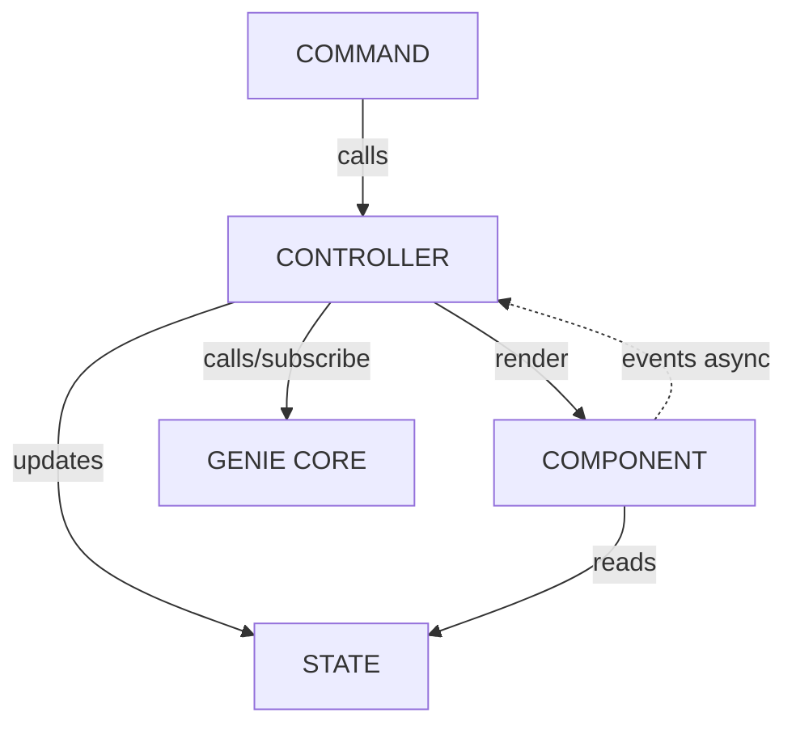
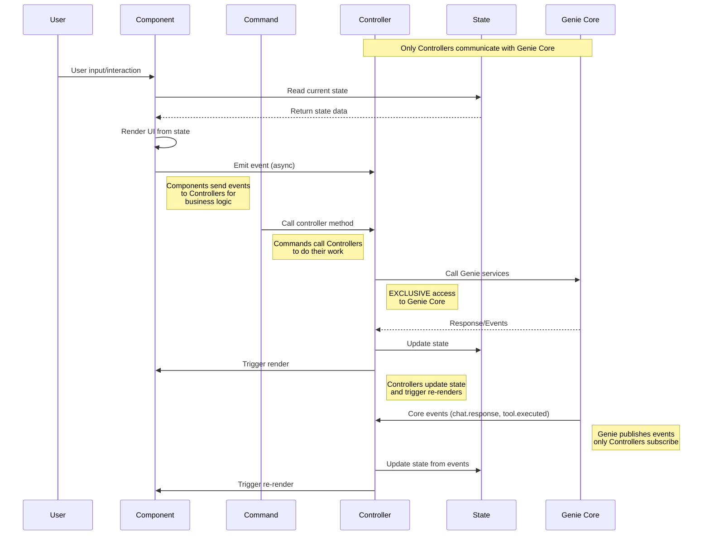

# TUI Architecture

This document describes the architecture of the Genie TUI (Terminal User Interface) client.

## Overview

The TUI follows a clean, layered architecture that separates concerns between the user interface layer and the core Genie business logic. The TUI acts as a client of the Genie core services, maintaining its own state and event management while delegating AI operations to the core.

## Architecture Diagrams

### Component Dependencies



### Interaction Flow



## Core Components

### 1. Commands
- **Location**: `cmd/tui/controllers/commands/`
- **Purpose**: Handle user input commands (e.g., `:help`, `:clear`, `:config`)
- **Pattern**: Each command implements the Command interface with `Execute()` method
- **Architecture**: **Commands call Controllers** to delegate actual work
- **Examples**: `ClearCommand`, `HelpCommand`, `ConfigCommand`, `ThemeCommand`

### 2. Controllers
- **Location**: `cmd/tui/controllers/`
- **Purpose**: Central orchestration layer that performs the actual business logic
- **Key Controllers**:
  - `ChatController`: Manages chat interactions and message flow
  - `StatusController`: Updates status bar information
- **Responsibilities**:
  - **Called by Commands** to perform business logic
  - Update state based on operations
  - Trigger component re-renders
  - **EXCLUSIVE** communication with Genie core services
  - Subscribe to core events and handle async responses

### 3. State
- **Location**: `cmd/tui/state/`
- **Purpose**: Manages TUI-specific application state
- **Key Components**:
  - `ChatState`: Messages, conversation history, loading state
  - `UIState`: Current view, theme, configuration
  - `StateAccessor`: Unified interface for state operations
- **Pattern**: Thread-safe state management with mutex protection

### 4. Components
- **Location**: `cmd/tui/component/`
- **Purpose**: UI rendering and view management
- **Key Components**:
  - `MessagesComponent`: Chat message display
  - `InputComponent`: User input handling
  - `StatusComponent`: Status bar display
  - `DebugComponent`: Debug information panel
- **Pattern**: Each component implements the `Component` interface with `Render()` method
- **Communication**: Send events to Controllers for business logic

### 5. Genie Core
- **Location**: `pkg/genie/`
- **Purpose**: Core AI functionality, session management, tool execution
- **Interface**: **ONLY Controllers** communicate with Genie through well-defined service interfaces
- **Responsibilities**:
  - AI prompt execution
  - Session management
  - Tool calling and execution
  - Event publishing for async operations

## Data Flow

### ① Component Renders from State
1. Components read current state via StateAccessor
2. Components format and display state data
3. Components handle user interactions (input, scrolling)
4. Components emit events to Controllers for business logic

### ② Controller Updates State
1. Controllers receive events from Components (async) OR are called by Commands
2. Controllers perform the actual business logic
3. Controllers call Genie core services when needed
4. Controllers update TUI state based on results
5. State changes trigger component re-renders

### ③ State Reads from Controller Updates
1. Controllers subscribe to Genie core events (e.g., `chat.response`, `tool.executed`)
2. Controllers handle async responses from Genie
3. Controllers update TUI state
4. State changes trigger UI updates

## Event-Driven Architecture

The TUI uses two levels of event systems:

### Core Events (`pkg/events`)
- **Purpose**: Communication between Genie core and Controllers
- **Examples**: `chat.response`, `chat.started`, `tool.executed`
- **Pattern**: Async event publishing for long-running operations
- **Access**: **ONLY Controllers** subscribe to these events

### Command Events (`cmd/events`)
- **Purpose**: TUI-internal communication between Components and Controllers
- **Examples**: `theme.changed`, `status.update`
- **Pattern**: Async event handling for UI coordination
- **Flow**: Components → Controllers via events

## Key Design Principles

### 1. Separation of Concerns
- **TUI Layer**: User interface, input handling, display formatting
- **Core Layer**: AI logic, session management, tool execution
- **Clear Boundaries**: Only Controllers access Genie core services

### 2. Event-Driven Updates
- Components communicate with Controllers via events (async)
- Controllers react to both UI events and core events
- Avoids tight coupling between UI and business logic

### 3. State Management
- Centralized state with controlled access via StateAccessor
- Thread-safe operations with proper synchronization
- Clear state ownership and mutation patterns

### 4. Controller Pattern
- Controllers are the **exclusive gateway** to Genie core
- Controllers orchestrate complex workflows
- Commands focus on single responsibilities
- Clear separation between command execution and state management

## Testing Architecture

### TUI Testing (`cmd/tui/testing/`)
- **TUIDriver**: High-level test interface for UI interactions
- **MockPromptRunner**: Mocks AI responses for predictable testing
- **Component Testing**: Individual component render and behavior tests
- **Integration Testing**: Full chat flow with mock expectations

### Test Pattern
```go
driver := NewTUIDriver(t)
driver.ExpectMessage("hello").RespondWith("Hi there!")
driver.Input().Type("hello").PressEnter()
// Verify expected behavior
```

**Note**: Special characters like `?` and `!` cause input system hangs - avoid in test messages.

## Directory Structure

```
cmd/tui/
├── ARCHITECTURE.md          # This document
├── app.go                   # Main TUI application
├── component/               # UI components
├── controllers/             # Business logic controllers
│   └── commands/           # Command implementations
├── helpers/                # Utility helpers
├── layout/                 # Layout management
├── presentation/           # Formatting and display logic
├── state/                  # State management
├── testing/                # Test infrastructure
└── types/                  # Type definitions
```

## Configuration

- **Settings**: `~/.genie/settings.tui.json`
- **History**: `.genie/history`
- **Themes**: Built-in theme system with user customization
- **Keybindings**: Configurable key mappings

## Future Considerations

1. **Remote Deployment**: Architecture supports future remote Genie core deployment
2. **Plugin System**: Controller pattern enables easy command extensibility
3. **Multiple Clients**: Clear separation allows multiple client implementations
4. **Real-time Collaboration**: Event system supports multi-user scenarios

---

*This architecture documentation reflects the current TUI implementation and design patterns established in the Genie project.*