# Genie Architecture - UML Diagram

This document contains the UML class diagram showing the main components of the Genie AI coding assistant and their relationships.

## Architecture Overview

The Genie system follows a clean, layered architecture with clear separation of concerns:

- **CLI/TUI Clients**: Independent interfaces that consume Genie services
- **Genie Core**: Central orchestrator that coordinates all services
- **Service Layer**: Specialized managers for different concerns
- **Event Bus**: Async communication backbone
- **External Services**: LLM clients and tool execution

```mermaid
classDiagram
    %% Client Layer
    class CLI {
        +Execute()
        +NewAskCommand() Command
        +NewAskCommandWithGenie(provider) Command
    }
    
    class TUI {
        +StartREPL(genie, session)
        +InitialModel(genie, session) ReplModel
        +HandleInput()
        +HandleEvents()
    }

    %% Core Genie Interface
    class Genie {
        <<interface>>
        +Start(workingDir) Session
        +Chat(ctx, sessionID, message) error
        +GetSession(sessionID) Session
        +GetEventBus() EventBus
    }

    %% Core Implementation
    class Core {
        -llmClient Gen
        -promptLoader Loader
        -sessionMgr SessionManager
        -historyMgr HistoryManager
        -contextMgr ContextManager
        -chatHistoryMgr ChatHistoryManager
        -eventBus EventBus
        -outputFormatter OutputFormatter
        -handlerRegistry HandlerRegistry
        -chainFactory ChainFactory
        -chainRunner ChainRunner
        -started bool
        +Start(workingDir) Session
        +Chat(ctx, sessionID, message) error
        +GetSession(sessionID) Session
        +GetEventBus() EventBus
        +processChat(ctx, sessionID, message) string
    }

    %% Session Management
    class SessionManager {
        <<interface>>
        +CreateSession(id, workingDir) Session
        +GetSession(id) Session
        +ListSessions() []Session
        +DeleteSession(id) error
    }

    class Session {
        +ID string
        +WorkingDirectory string
        +CreatedAt string
        +Interactions []Interaction
        +AddInteraction(message, response)
    }

    %% History Management
    class HistoryManager {
        <<interface>>
        +AddInteraction(sessionID, message, response)
        +GetHistory(sessionID, limit) []Interaction
        +ClearHistory(sessionID)
    }

    class ChatHistoryManager {
        -filePath string
        +AddCommand(command)
        +GetHistory() []string
        +Load() error
        +Save() error
    }

    %% Context Management
    class ContextManager {
        <<interface>>
        +GetConversationContext(sessionID, maxPairs) string
        +AddContext(sessionID, context)
        +ClearContext(sessionID)
    }

    %% Event System
    class EventBus {
        <<interface>>
        +Publish(topic, event)
        +Subscribe(topic, handler)
        +Unsubscribe(topic, handler)
    }

    class ChatResponseEvent {
        +SessionID string
        +Message string
        +Response string
        +Error error
        +Topic() string
    }

    class ToolExecutedEvent {
        +SessionID string
        +ToolName string
        +Parameters map[string]any
        +Message string
        +Topic() string
    }

    %% AI Chain Processing
    class ChainFactory {
        <<interface>>
        +CreateChatChain(promptLoader) Chain
    }

    class ChainRunner {
        <<interface>>
        +RunChain(ctx, chain, chainCtx, eventBus) error
    }

    class Chain {
        +Name string
        +Steps []Step
        +Run(ctx, llm, chainCtx, eventBus, debug) error
    }

    %% Prompt System
    class PromptLoader {
        <<interface>>
        +LoadPrompt(name) Prompt
        +GetAvailablePrompts() []string
    }

    class Prompt {
        +Name string
        +Instruction string
        +Text string
        +RequiredTools []string
    }

    %% Tool System
    class ToolRegistry {
        <<interface>>
        +Register(tool) error
        +GetAll() []Tool
        +Get(name) Tool
        +Names() []string
    }

    class Tool {
        <<interface>>
        +Declaration() FunctionDeclaration
        +Handler() HandlerFunc
        +FormatOutput(result) string
    }

    class OutputFormatter {
        +FormatToolResponse(toolName, result) string
        +FormatError(error) string
    }

    %% LLM Integration
    class Gen {
        <<interface>>
        +GenerateContent(ctx, messages, tools) Response
        +CreateMessage(role, content) Message
    }

    class VertexClient {
        -projectID string
        -client *genai.Client
        +GenerateContent(ctx, messages, tools) Response
        +CreateMessage(role, content) Message
    }

    %% Handler Registry
    class HandlerRegistry {
        +RegisterHandler(name, handler)
        +GetHandler(name) Handler
        +GetAllHandlers() map[string]Handler
    }

    %% Dependencies Structure
    class Dependencies {
        +LLMClient Gen
        +PromptLoader Loader
        +SessionMgr SessionManager
        +HistoryMgr HistoryManager
        +ContextMgr ContextManager
        +ChatHistoryMgr ChatHistoryManager
        +EventBus EventBus
        +OutputFormatter OutputFormatter
        +HandlerRegistry HandlerRegistry
        +ChainFactory ChainFactory
        +ChainRunner ChainRunner
    }

    %% Relationships
    CLI --> Genie : uses
    TUI --> Genie : uses
    
    Genie <|-- Core : implements
    
    Core --> SessionManager : manages sessions
    Core --> HistoryManager : tracks history
    Core --> ContextManager : builds context
    Core --> ChatHistoryManager : persists chat
    Core --> EventBus : publishes events
    Core --> PromptLoader : loads prompts
    Core --> ChainFactory : creates chains
    Core --> ChainRunner : executes chains
    Core --> Gen : calls LLM
    Core --> OutputFormatter : formats output
    Core --> HandlerRegistry : processes responses
    
    SessionManager --> Session : creates/manages
    Session --> Interaction : contains
    
    EventBus --> ChatResponseEvent : publishes
    EventBus --> ToolExecutedEvent : publishes
    
    ChainFactory --> Chain : creates
    ChainRunner --> Chain : executes
    Chain --> Gen : uses
    Chain --> ToolRegistry : accesses tools
    
    PromptLoader --> Prompt : loads
    
    ToolRegistry --> Tool : contains
    Tool --> OutputFormatter : uses
    
    Gen <|-- VertexClient : implements
    
    Dependencies --> Core : configures
    Dependencies --> SessionManager : provides
    Dependencies --> HistoryManager : provides
    Dependencies --> ContextManager : provides
    Dependencies --> ChatHistoryManager : provides
    Dependencies --> EventBus : provides
    Dependencies --> PromptLoader : provides
    Dependencies --> ChainFactory : provides
    Dependencies --> ChainRunner : provides
    Dependencies --> Gen : provides
    Dependencies --> OutputFormatter : provides
    Dependencies --> HandlerRegistry : provides

    %% Event Flow (dotted lines for event subscriptions)
    CLI ..> EventBus : subscribes to events
    TUI ..> EventBus : subscribes to events
    Core ..> EventBus : publishes events
    ChainRunner ..> EventBus : publishes tool events
```

## Key Architecture Principles

### 1. **Clean Separation of Concerns**
- **CLI/TUI**: User interface layers (thin clients)
- **Core**: Business logic orchestration
- **Services**: Specialized domain managers
- **Tools**: External operation executors

### 2. **Event-Driven Communication**
- Async responses via event bus
- Loose coupling between components
- Easy to extend with new event types

### 3. **Dependency Injection**
- All dependencies injected via Dependencies struct
- Easy testing with mock implementations
- Clean dependency graph

### 4. **Interface-Based Design**
- All major components are interfaces
- Easy to swap implementations
- Testable and mockable

### 5. **Distributed-Ready Architecture**
- `GetEventBus()` abstracts communication
- Can scale from local to remote easily
- Event bus can become network transport

## Component Responsibilities

### **Genie Core**
- Orchestrates all services
- Manages application lifecycle
- Provides unified API to clients

### **Session Manager**
- Creates and manages conversation sessions
- Tracks session state and metadata
- Provides session lifecycle management

### **History Managers**
- **HistoryManager**: In-memory conversation history
- **ChatHistoryManager**: Persistent command history

### **Context Manager**
- Builds conversation context for LLM
- Manages context window and relevance
- Provides context summarization

### **Event Bus**
- Async communication backbone
- Publishes tool execution events
- Delivers chat responses to clients

### **Chain System**
- **ChainFactory**: Creates AI processing chains
- **ChainRunner**: Executes chains with LLM
- **Chain**: Defines processing workflow

### **Tool System**
- **ToolRegistry**: Manages available tools
- **Tool**: Individual tool implementations
- **OutputFormatter**: Formats tool responses

### **LLM Integration**
- **Gen**: Abstract LLM interface
- **VertexClient**: Google Vertex AI implementation
- Provides model-agnostic AI access

This architecture enables the system to be modular, testable, and ready for distributed deployment while maintaining clean separation of concerns.